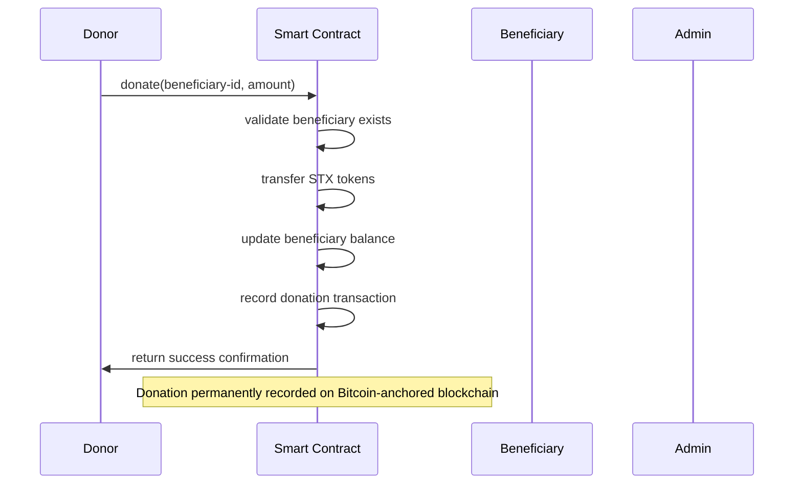
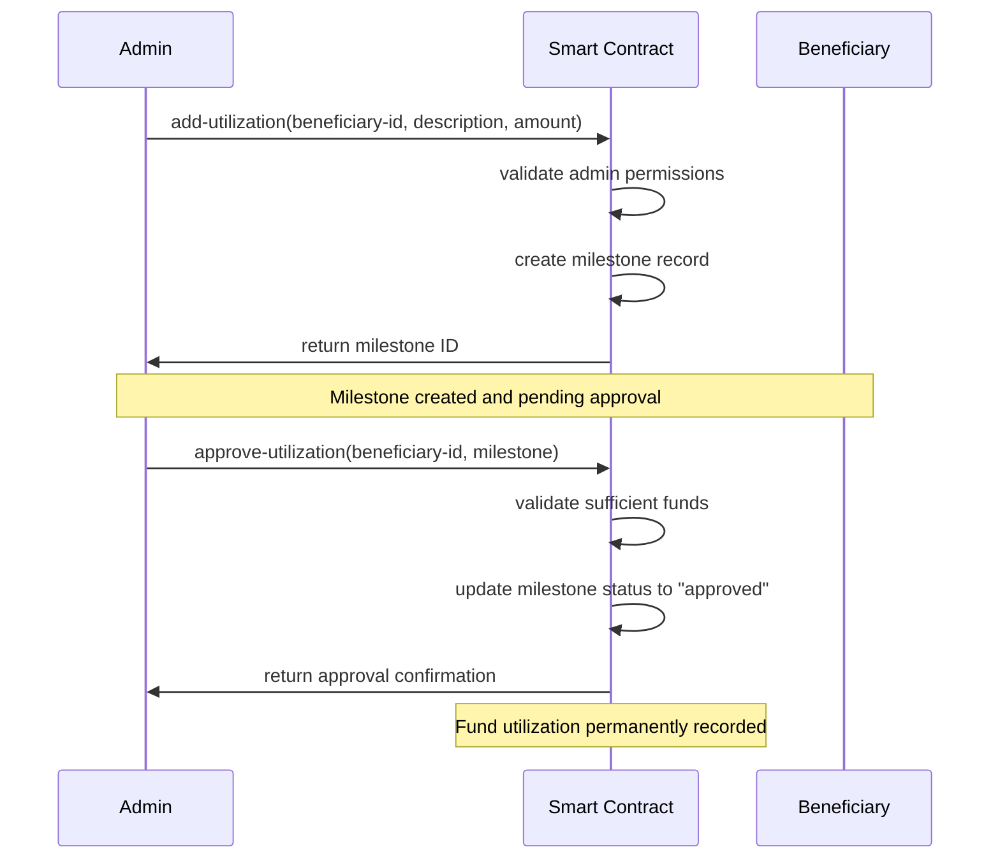

# StacksGive Protocol

## Bitcoin-Secured Transparent Charity Platform on Stacks Layer 2

[](https://stacks.co)
[](https://bitcoin.org)
[](https://github.com/stacksgive/protocol)

## 🌟 Overview

StacksGive revolutionizes charitable giving by creating a trustless, transparent donation ecosystem built on Bitcoin's immutable foundation through Stacks Layer 2. The protocol enables unprecedented accountability in charitable fund management, ensuring every donation is tracked, every disbursement is verified, and every milestone is cryptographically recorded.

### Key Value Propositions

- **🔒 Bitcoin-Grade Security**: Leverages Bitcoin's hash power for immutable donation records
- **🌐 Complete Transparency**: Real-time tracking of fund flows and utilization
- **🎯 Milestone-Based Disbursements**: Ensures funds are released based on verified progress
- **⚡ Cost-Efficient**: Stacks Layer 2 provides Bitcoin security without high transaction fees
- **🏛️ Regulatory Compliant**: Built-in governance and audit trails for compliance requirements

## 🏗️ System Architecture

### High-Level Architecture

```
┌─────────────────────┐    ┌─────────────────────┐    ┌─────────────────────┐
│                     │    │                     │    │                     │
│     Donors          │    │   Beneficiaries     │    │   Administrators    │
│                     │    │                     │    │                     │
└──────────┬──────────┘    └──────────┬──────────┘    └──────────┬──────────┘
           │                          │                          │
           │          Donations       │         Fund Requests    │
           └──────────────┬───────────┼──────────────┬───────────┘
                          │           │              │
                          ▼           ▼              ▼
                   ┌─────────────────────────────────────────┐
                   │                                         │
                   │        StacksGive Protocol             │
                   │     (Stacks Smart Contract)            │
                   │                                         │
                   └─────────────────────────────────────────┘
                                      │
                                      ▼
                   ┌─────────────────────────────────────────┐
                   │                                         │
                   │          Stacks Layer 2                │
                   │      (Clarity Smart Contracts)         │
                   │                                         │
                   └─────────────────────────────────────────┘
                                      │
                                      ▼
                   ┌─────────────────────────────────────────┐
                   │                                         │
                   │           Bitcoin Network              │
                   │        (Security Anchor)               │
                   │                                         │
                   └─────────────────────────────────────────┘
```

### Technology Stack

| Layer | Technology | Purpose |
|-------|------------|---------|
| **Security Layer** | Bitcoin Blockchain | Immutable consensus and final settlement |
| **Smart Contract Layer** | Stacks Layer 2 | Smart contract execution and state management |
| **Programming Language** | Clarity | Safe, decidable smart contract language |
| **Consensus** | Proof of Transfer (PoX) | Energy-efficient consensus secured by Bitcoin |

## 🏛️ Contract Architecture

### Core Components

```
StacksGive Protocol
├── Governance Layer
│   ├── Role Management (Admin/Moderator/Beneficiary)
│   ├── Access Control
│   └── Owner Management
├── Beneficiary Management
│   ├── Registration System
│   ├── Profile Management
│   └── Status Tracking
├── Donation Engine
│   ├── STX Token Transfers
│   ├── Transaction Recording
│   └── Balance Tracking
├── Utilization Framework
│   ├── Milestone Creation
│   ├── Approval Workflow
│   └── Progress Tracking
└── Data Layer
    ├── Immutable Transaction Logs
    ├── Beneficiary Registry
    └── Utilization Records
```

### Role-Based Access Control

| Role | Permissions | Description |
|------|-------------|-------------|
| **Admin (Level 1)** | Full system control | Can approve fund utilization, assign roles |
| **Moderator (Level 2)** | Beneficiary management | Can register and manage beneficiaries |
| **Beneficiary (Level 3)** | Profile access | Can view their donation status and milestones |

### Data Structures

#### Beneficiary Registry

```clarity
{
  id: uint,
  name: string-utf8,
  description: string-utf8,
  target-amount: uint,
  received-amount: uint,
  status: string-ascii
}
```

#### Donation Records

```clarity
{
  id: uint,
  donor: principal,
  beneficiary-id: uint,
  amount: uint,
  timestamp: uint
}
```

#### Utilization Tracking

```clarity
{
  id: uint,
  beneficiary-id: uint,
  milestone: uint,
  description: string-utf8,
  amount: uint,
  status: string-ascii
}
```

## 🔄 Data Flow

### Donation Flow



### Fund Utilization Flow



### System State Flow

```
[Contract Deployment] 
         ↓
[Owner Initialization]
         ↓
[Role Assignment] ← [User Registration]
         ↓
[Beneficiary Registration] ← [Moderator Action]
         ↓
[Donation Processing] ← [Donor Interaction]
         ↓
[Milestone Creation] ← [Admin Action]
         ↓
[Fund Utilization] ← [Admin Approval]
         ↓
[Transparency & Audit]
```

## 🚀 Quick Start

### Prerequisites

- Stacks wallet (Hiro Wallet recommended)
- STX tokens for donations and gas fees
- Access to Stacks blockchain (Mainnet/Testnet)

### Deployment

1. **Clone the repository**

   ```bash
   git clone https://github.com/joy-fmt/stacksgive-protocol.git
   cd stacksgive-protocol
   ```

2. **Deploy to Stacks**

   ```bash
   clarinet deploy --network testnet
   ```

3. **Initialize contract**
   The contract auto-initializes with the deployer as admin.

### Basic Usage

#### For Administrators

```clarity
;; Assign moderator role
(contract-call? .stacksgive set-role 'SP1ABC...XYZ u2)

;; Register a beneficiary
(contract-call? .stacksgive register-beneficiary 
  u"Local Food Bank" 
  u"Providing meals for families in need" 
  u1000000) ;; 1000 STX target
```

#### For Donors

```clarity
;; Make a donation
(contract-call? .stacksgive donate u1 u100000) ;; 100 STX to beneficiary #1
```

#### For Fund Management

```clarity
;; Create utilization milestone
(contract-call? .stacksgive add-utilization 
  u1 
  u"Purchase food supplies for Q1" 
  u250000) ;; 250 STX

;; Approve milestone
(contract-call? .stacksgive approve-utilization u1 u1)
```

## 📊 Key Features

### Transparency & Accountability

- **Immutable Records**: All transactions permanently recorded on Bitcoin-anchored blockchain
- **Real-time Tracking**: Live updates on donation amounts and fund utilization
- **Public Auditing**: Open-source contract code and transparent operations

### Security & Trust

- **Bitcoin Security**: Leverages Bitcoin's hash power for ultimate security
- **Role-based Access**: Multi-tier permission system prevents unauthorized actions
- **Safe Language**: Clarity language prevents common smart contract vulnerabilities

### Efficiency & Scalability

- **Low Transaction Costs**: Stacks Layer 2 provides Bitcoin security without high fees
- **Fast Confirmations**: Quick transaction processing on Stacks network
- **Scalable Architecture**: Designed to handle high volume of donations

## 🔒 Security Considerations

### Smart Contract Security

- **No Reentrancy**: Clarity language prevents reentrancy attacks
- **Integer Overflow Protection**: Built-in overflow protection
- **Access Control**: Comprehensive role-based permissions

### Operational Security

- **Owner Protection**: Contract owner cannot be changed accidentally
- **Role Management**: Secure role assignment and removal procedures
- **Fund Safety**: STX tokens held securely in contract account

## 🛣️ Roadmap

### Phase 1: Core Protocol (Current)

- ✅ Basic donation functionality
- ✅ Role-based access control
- ✅ Milestone tracking
- ✅ Fund utilization management

### Phase 2: Enhanced Features

- 🔄 Multi-token support (SIP-010 tokens)
- 🔄 Automated milestone triggers
- 🔄 Donation matching programs
- 🔄 Integration with external oracles

### Phase 3: Ecosystem Expansion

- 📅 Web interface and mobile app
- 📅 API for third-party integrations
- 📅 Advanced analytics dashboard
- 📅 Cross-chain bridge support

## 🤝 Contributing

We welcome contributions from the community! Please see our [Contributing Guidelines](CONTRIBUTING.md) for details.

### Development Setup

1. Install Clarinet
2. Fork the repository
3. Create feature branch
4. Run tests: `clarinet test`
5. Submit pull request
